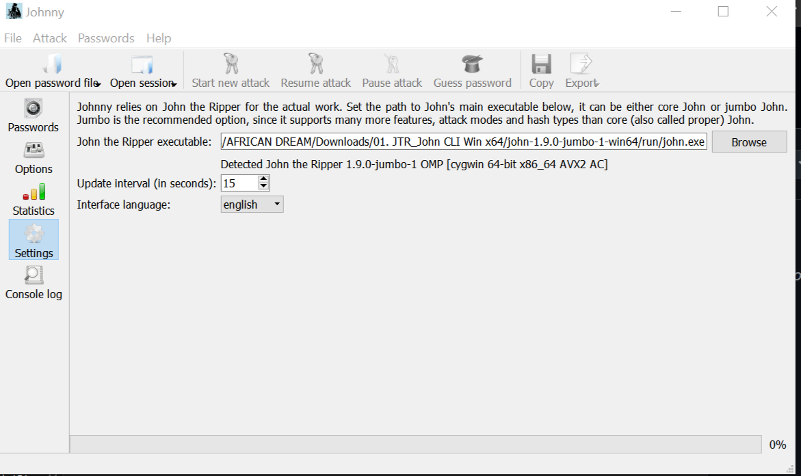

# Week 3: Gaining Access - Password Cracking with Johnny and Networkwalks Tools.

## Cybersecurity Internship Assignment

### 📌 Overview
This week focuses on gaining access to password-protected PDF files using two tools:
1. **Johnny** - GUI frontend for John the Ripper
2. **Networkwalks Tools** - Hash Calculator & Password Cracker

---

## Using Johnny.
### 🎯 Objectives
- Extract password hashes from encrypted PDF files using online tool
- Use Johnny GUI to perform dictionary attacks
- Successfully crack passwords and access locked documents

---

### 🛠️ Tools Used

| Tool | Purpose |
|------|---------|
| **Johnny** | GUI frontend for John the Ripper |
| **John the Ripper** | Password cracking engine |
| **Online PDF Hash Extractor** | Extract PDF password hashes |

---

### 💡 Key Learnings
- Hash extraction from PDFs
- Dictionary attacks with Johnny
- Cracking with Networkwalks tools
- Password security importance

## 🔧 Step-by-Step Process

### Step 1: Install Johnny
1. Download from: https://github.com/openwall/johnny/releases
2. Install and launch
3. Go to **Settings** → Set path: `JTR_John CLI Win x64\john-1.9.0-jumbo-1-win64\run`

### Step 2: Extract PDF Hash
1. Go to: https://www.onlinehashcrack.com/tools-pdf-hash-extractor.php
2. Upload PDF → Click **Upload**
3. Copy the hash

### Step 3: Save Hash
1. Open Notepad
2. Paste hash
3. Save as `hash.txt` in `hashes/` folder

### Step 4: Load Hash in Johnny
1. Open Johnny
2. Click **File** → **Open Password File**
3. Select `hash.txt`

### Step 5: View Password
1. Click **Results** tab
2. Check **Show only cracked**
3. View password

---

## 📊 Results

| PDF File | Cracked Password |
|----------|------------------|
| My Locked PDF1 | good-luck |
| My Locked PDF2 | password1 |
| My Locked PDF3 | good-luck |

---

# Password Cracking with Networkwalks tools

### 📌 Overview
Using Networkwalks tools to crack password-protected PDF files. The process involves two steps:
1. **Hash Calculator** - Extract hash from PDF
2. **Password Cracker** - Crack the extracted hash using wordlists

---

### 🛠️ Tools Used

| Tool | Purpose |
|------|---------|
| **Networkwalks Hash Calculator** | Extract PDF password hashes |
| **Networkwalks Password Cracker** | Crack hashes using wordlists |

---
### Steps
1. Open Hash Calculator → Upload PDF → Get Hash
2. Copy hash 
3. Open Password Cracker → Load hash
4. Select wordlist (built-in or custom)
5. Click Start → View cracked password

### Results
| PDF File | Cracked Password |
|----------|------------------|
| My Locked PDF1 | good-luck |
| My Locked PDF2 | password1 |
| My Locked PDF3 | good-luck |
